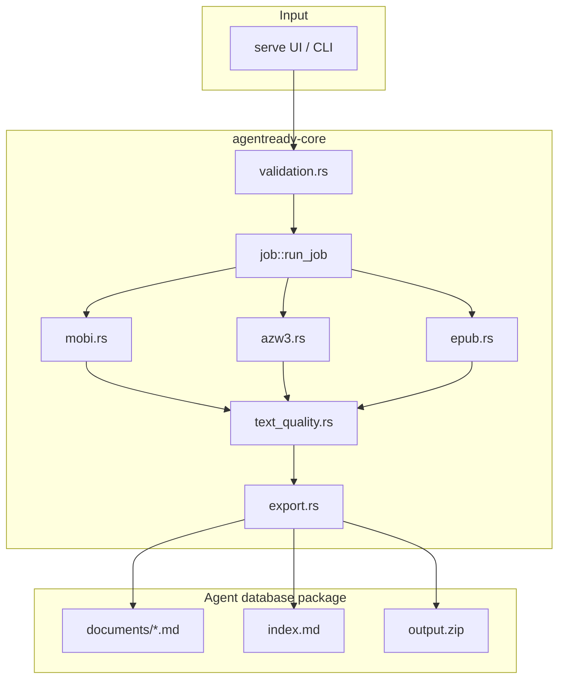

# Plan: Ebook Agent Export (MOBI + AZW3)

> Spec: ./spec.md · **Status:** Draft

## Approach

**Stabilize → MOBI → AZW3 → verify → document.** Use pure Rust parsers first (crates.io, MIT/Apache only). Reuse EPUB's HTML→Markdown path for AZW3/KF8 where structure matches. Never add DRM stripping. Three to four focused sessions.

## Architecture

**AZW routing:** sniff magic bytes in `job.rs` or `converters/kindle_sniff.rs` — `.azw` → MOBI or AZW3 handler.

## File structure

| File | Create / Modify | Responsibility |
|------|-----------------|----------------|
| `crates/agentready-core/src/converters/mobi.rs` | Create | MOBI/PalmDOC text extraction, DRM sniff |
| `crates/agentready-core/src/converters/azw3.rs` | Create | KF8 container parse, HTML extract |
| `crates/agentready-core/src/converters/html_md.rs` | Create (if needed) | Shared HTML→Markdown from epub.rs |
| `crates/agentready-core/src/converters/mod.rs` | Modify | Register modules |
| `crates/agentready-core/src/validation.rs` | Modify | Allow `mobi`, `azw3`, `azw` |
| `crates/agentready-core/src/job.rs` | Modify | Match arms + timeout |
| `crates/agentready-core/src/models.rs` | Modify | Error messages if needed |
| `crates/agentready-cli/src/serve.rs` | Modify | Upload allowlist |
| `crates/agentready-cli/static/index.html` | Modify | accept + supported copy |
| `crates/agentready-core/Cargo.toml` | Modify | MOBI crate dependency if chosen |
| `crates/agentready-cli/tests/integration.rs` | Modify | EPUB CLI test |
| `examples/sample-input/ebooks/README.md` | Create | Test file generation guide |
| `README.md` | Modify | Supported formats table |
| `docs/08_CONVERSION_PIPELINE.md` | Modify | MOBI/AZW3 rows |
| `AGENTREADY_V1_SDD_MASTER.md` | Modify | Remove EPUB/MOBI from non-goals when shipped |

**Phase 0 (baseline — already in tree):**

| File | Status |
|------|--------|
| `converters/epub.rs` | Done |
| `text_quality.rs` | Done |
| `export.rs` legal block | Done |
| `docs/23_CONTENT_OWNERSHIP_AND_LEGAL.md` | Done |

## Verification strategy

| Check | Command / action | Expected |
|-------|------------------|----------|
| Compile | `cargo check` | exit 0 |
| Unit tests | `cargo test` | all pass |
| Lint | `cargo clippy -p agentready-core -p agentready -- -D warnings` | clean or justified |
| CLI TXT | `cargo run -- convert examples/sample-input/clean --output /tmp/ar-test` | Success |
| CLI EPUB | synthetic or sample epub | `documents/*.md` exists |
| CLI MOBI | Dwayne's DRM-free local file | readable markdown |
| CLI AZW3 | Dwayne's DRM-free local file | readable markdown |
| DRM reject | known DRM file (local only) | `PasswordProtected` |
| UI smoke | `./scripts/serve.sh --no-open --port 3099` | upload + preview + zip |
| Export legal | open zip `README.md` | Legal notice section present |
| Spec drift | README vs validation extensions | aligned |

## Risks / unknowns

| Risk | Mitigation |
|------|------------|
| No suitable Rust MOBI crate | 30-min spike; document alternatives; ask Dwayne re Calibre |
| AZW3 format variants | Partial status + warning; fixture-driven tests |
| GPL crate temptation | License check before adding dep |
| Master SDD says EPUB non-goal | Update master when EPUB+ebooks ship |
| Copyright / DRM liability | `docs/23` — reject DRM, user warranty |

## Phases (execution order)

1. **Phase 0** — Stabilize uncommitted baseline (`cargo test`, smoke UI)
2. **Phase 1** — MOBI converter + wiring
3. **Phase 2** — AZW3 + AZW router (+ optional `html_md` extract)
4. **Phase 3** — Integration tests + `examples/sample-input/ebooks/`
5. **Phase 4** — Docs + README + manual QA matrix
